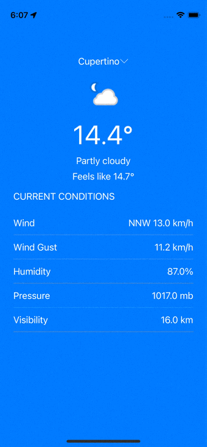

## WeatherApp
An iOS app that detects user's current location and display the weather forecast data accordingly. It also allows user to search other location and display their weather forecast data.

## Walkthrough

## Features
- Using MVVM architecture
- Unit test on business and some presentation logic
- Detect and display weather forecast data based on user's current location
- Allow searching other cities and support autocompletion while user searches
